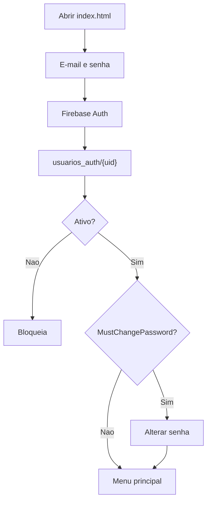
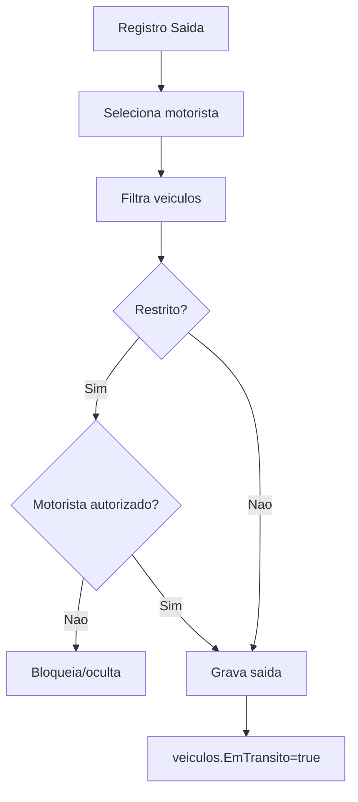
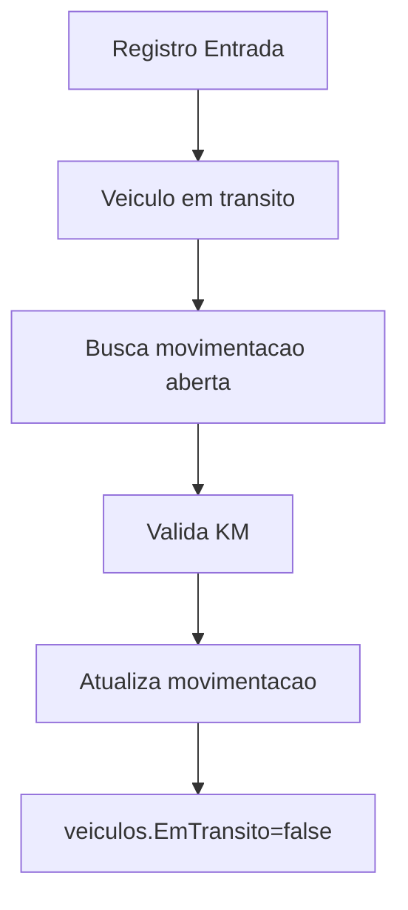
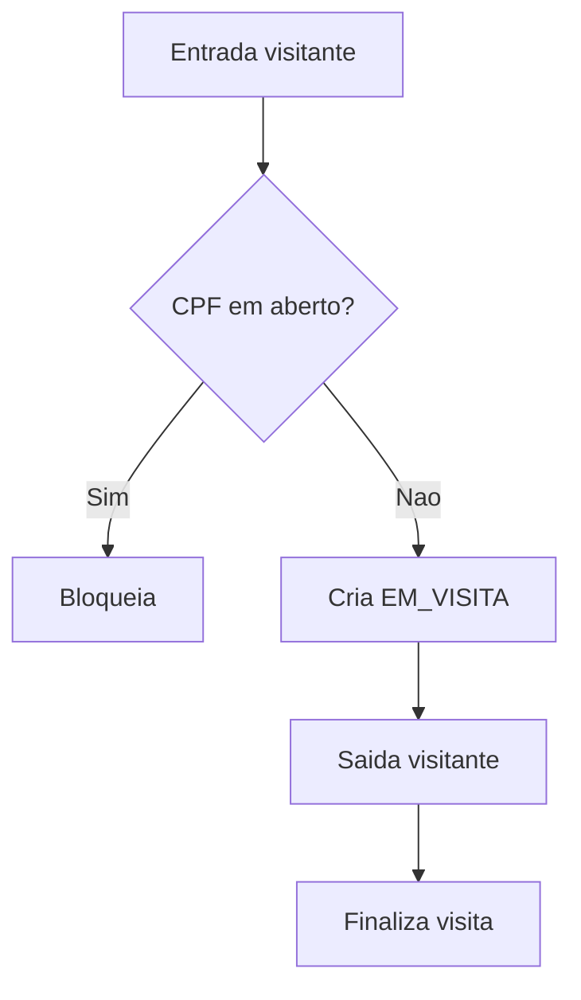

# Fluxos

## Login

```mermaid
flowchart TD
  A["Abrir index.html"] --> B["E-mail e senha"]
  B --> C["Firebase Auth"]
  C --> D["usuarios_auth/{uid}"]
  D --> E{"Ativo?"}
  E -->|Nao| F["Bloqueia"]
  E -->|Sim| G{"MustChangePassword?"}
  G -->|Sim| H["Alterar senha"]
  G -->|Nao| I["Menu principal"]
  H --> I
```

## Saida

```mermaid
flowchart TD
  A["Registro Saida"] --> B["Seleciona motorista"]
  B --> C["Filtra veiculos"]
  C --> D{"Restrito?"}
  D -->|Sim| E{"Motorista autorizado?"}
  E -->|Nao| F["Bloqueia/oculta"]
  E -->|Sim| G["Grava saida"]
  D -->|Nao| G
  G --> H["veiculos.EmTransito=true"]
```

## Entrada

```mermaid
flowchart TD
  A["Registro Entrada"] --> B["Veiculo em transito"]
  B --> C["Busca movimentacao aberta"]
  C --> D["Valida KM"]
  D --> E["Atualiza movimentacao"]
  E --> F["veiculos.EmTransito=false"]
```

## Visitantes

```mermaid
flowchart TD
  A["Entrada visitante"] --> B{"CPF em aberto?"}
  B -->|Sim| C["Bloqueia"]
  B -->|Nao| D["Cria EM_VISITA"]
  D --> E["Saida visitante"]
  E --> F["Finaliza visita"]
```
